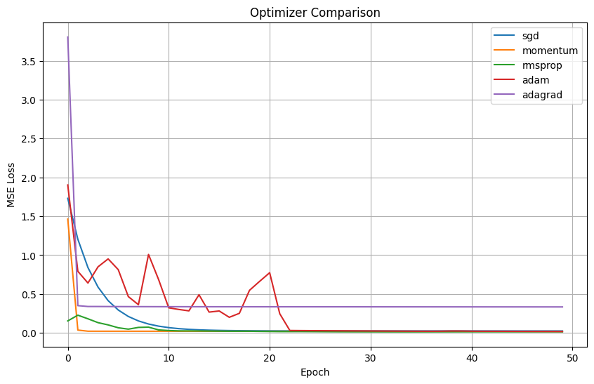

# 🧠 NANOTORCH

**NanoTorch** is a tiny, educational **autograd engine** written in pure Python for understanding how neural networks work under the hood.It is **not** meant for production use.

The goal is to **learn**:

- Automatic differentiation
- Backpropagation
- How neural networks are built from scratch
- How frameworks like PyTorch work internally

[](https://github.com/bhatishan2003/nanotorch/actions/workflows/test.yml)
[](https://codecov.io/gh/bhatishan2003/nanotorch)

## Features

- **Layers**
    - ✅ Linear Layer
    - ✅ Vanilla Recurrent (RNN) Layer
    - ⬜ LSTM Layer
    - ⬜ GRU Layer
    - ⬜ Convolutional (CNN) Layer
    - ⬜ Transformer-based Layer

- **Optimizers**
    - ✅ Stochastic Gradient Descent (SGD)
    - ✅ Adam
    - ✅ RMSProp
    - ✅ Adagrad

- **Loss Functions**
    - ✅ Mean Squared Error (MSE) Loss
    - ✅ Mean Absolute Error (MAE)
    - ⬜ Cross-Entropy Loss
    - ⬜ Huber Loss

- **Training Utilities**
    - ⬜ Learning Rate Scheduler
    - ⬜ Gradient Clipping
    - ✅ Early Stopping

## 📦 Installation

Clone the repository and install locally:

```bash
git clone https://github.com/your-username/nanotorch.git
cd nanotorch
pip install -e .
```

## 🚀 Quick Start

### 1️⃣ Creating Tensors

```python
from nanotorch import Tensor

x = Tensor(2.0)
y = Tensor(3.0)

z = x * y + x
z.backward()

print(z.data)   # 8.0
print(x.grad)   # dz/dx = y + 1 = 4
print(y.grad)   # dz/dy = x = 2
```

### 2️⃣ Mean Squared Error (MSE)

```python
y_true = Tensor(4.0)
y_pred = Tensor(2.5)

loss = (y_pred - y_true) ** 2
loss.backward()

print("Loss:", loss.data)
print("dLoss/dy_pred:", y_pred.grad)
```

### 3️⃣ Autograd Example (Chain Rule)

```python
x = Tensor(3.0)
y = x ** 2
z = y + x + 5

z.backward()

print("z =", z.data)
print("dz/dx =", x.grad)
```

## 📂 Examples

### Training on the California Housing Dataset

The `examples/train_california_dataset.py` script demonstrates how to use **NanoTorch** to train a simple neural network on a real-world regression dataset(For Linear Netowrk).
This example covers:

- Loading a real dataset
- Forward pass using NanoTorch tensors
- L1 Loss
- Automatic backpropagation
- Parameter updates with SGD

### ▶️ How to Run

From the project root directory, run:

```bash
python examples/train_california_dataset.py
```

```bash
Epoch #1| Epoch Loss: 32907.97 | Batch: 100%|██████████████████████████████| 81/81 [00:00<00:00, 430.88it/s]
Epoch #2| Epoch Loss: 218.15 | Batch: 100%|████████████████████████████████| 81/81 [00:00<00:00, 292.88it/s]
Epoch #3| Epoch Loss: 81.03 | Batch: 100%|█████████████████████████████████| 81/81 [00:00<00:00, 750.43it/s]
Epoch #4| Epoch Loss: 23.94 | Batch: 100%|█████████████████████████████████| 81/81 [00:00<00:00, 578.37it/s]
Epoch #5| Epoch Loss: 5.27 | Batch: 100%|██████████████████████████████████| 81/81 [00:00<00:00, 712.15it/s]
Epoch #6| Epoch Loss: 1.46 | Batch: 100%|██████████████████████████████████| 81/81 [00:00<00:00, 672.09it/s]
Epoch #7| Epoch Loss: 1.45 | Batch: 100%|█████████████████████████████████| 81/81 [00:00<00:00, 1248.95it/s]
Epoch #8| Epoch Loss: 1.44 | Batch: 100%|██████████████████████████████████| 81/81 [00:00<00:00, 951.78it/s]
Epoch #9| Epoch Loss: 1.44 | Batch: 100%|██████████████████████████████████| 81/81 [00:00<00:00, 745.92it/s]
Epoch #10| Epoch Loss: 1.43 | Batch: 100%|█████████████████████████████████| 81/81 [00:00<00:00, 889.40it/s]
Epoch #11| Epoch Loss: 1.42 | Batch: 100%|█████████████████████████████████| 81/81 [00:00<00:00, 853.22it/s]
Epoch #12| Epoch Loss: 1.42 | Batch: 100%|████████████████████████████████| 81/81 [00:00<00:00, 1200.56it/s]
Epoch #13| Epoch Loss: 1.41 | Batch: 100%|████████████████████████████████| 81/81 [00:00<00:00, 1186.36it/s]
Epoch #14| Epoch Loss: 1.40 | Batch: 100%|█████████████████████████████████| 81/81 [00:00<00:00, 720.77it/s]
Epoch #15| Epoch Loss: 1.40 | Batch: 100%|████████████████████████████████| 81/81 [00:00<00:00, 1112.29it/s]
Epoch #16| Epoch Loss: 1.39 | Batch: 100%|█████████████████████████████████| 81/81 [00:00<00:00, 925.98it/s]
Epoch #17| Epoch Loss: 1.38 | Batch: 100%|████████████████████████████████| 81/81 [00:00<00:00, 1044.80it/s]
Epoch #18| Epoch Loss: 1.38 | Batch: 100%|█████████████████████████████████| 81/81 [00:00<00:00, 385.59it/s]
Epoch #19| Epoch Loss: 1.37 | Batch: 100%|█████████████████████████████████| 81/81 [00:00<00:00, 549.88it/s]
Epoch #20| Epoch Loss: 1.37 | Batch: 100%|█████████████████████████████████| 81/81 [00:00<00:00, 982.30it/s]
```

### Training on the Sydney Temperature Dataset

The `examples/train_sydney_dataset.py` script demonstrates how to use **NanoTorch** to train a Recurrent neural network on a real-world time-series dataset.

```bash
python examples/train_sydney_dataset.py
```

```bash
Epoch 1/100: 100%|██████████████████████████████████████████████████████████████████████████████████████████████████| 91/91 [00:01<00:00, 46.43it/s, loss=0.066364]
Epoch 1/100 | Avg Loss: 0.152492
Epoch 2/100: 100%|██████████████████████████████████████████████████████████████████████████████████████████████████| 91/91 [00:02<00:00, 39.32it/s, loss=0.047069]
Epoch 2/100 | Avg Loss: 0.115263
Epoch 3/100: 100%|██████████████████████████████████████████████████████████████████████████████████████████████████| 91/91 [00:01<00:00, 62.92it/s, loss=0.035285]
```

### Plot for optimizer comparison

- RNN plot
    - This plot show comparisons between different optimizer algorithms.

    
